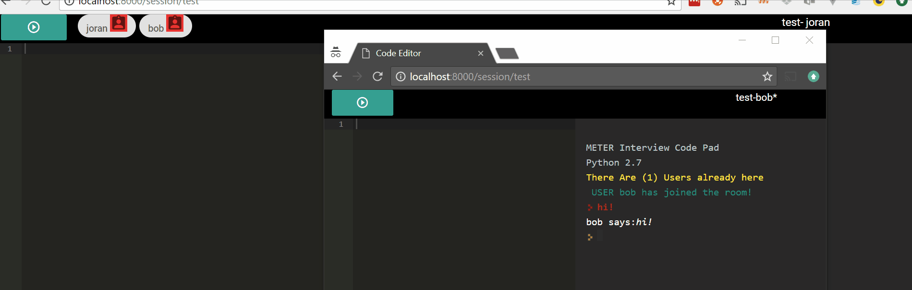

INSTALL
-------
`pip install git+git://github.com/joranbeasley/Flask-CodingPad#egg=CoderPad -U`

**additionally requires** eventlet or some other backend supported by [Flask-Socketio](https://flask-socketio.readthedocs.io/en/latest/#requirements)

RUN THE SERVER
--------------
(note that these scripts should be found in your python scripts folder, which hopefully is already on your path, assuming that you install the package with pip)

`serve-coderpad` 

you can use the 

`setup-coderpad` command to configure your server (This should run automagically the first time you run the server)

Disclaimer
----------
I needed this tool... i made it ... it felt good.

I make no promises that it will work for you, that it will work efficiently, or that it wont break at a critical time, however please notify me if any of these things happen

WISHLIST
--------

* add support for languages other than python *should be easy(tm)*
* change the themes for ace editor dynamically
* XSS injection in chat panel needs to be identified and fixed
* can we use angular for the editor page?
* add unittests/doctests etc

